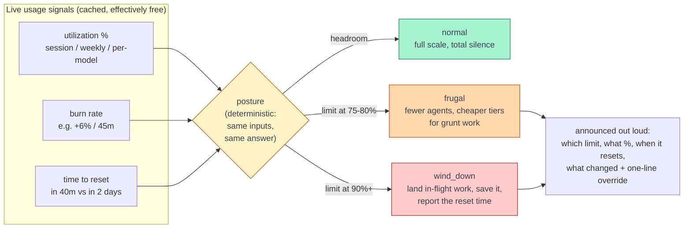

# usage-governor

[](https://github.com/johnlawrimore/usage-governor/actions/workflows/test.yml)
[](CHANGELOG.md)
[](#standalone-cli)
[](#install)
[](LICENSE)

### Tired of your agent runs dying at "usage limit reached"?

**usage-governor** is a [Claude Code](https://claude.com/claude-code) skill that teaches Claude to
watch the fuel gauge and drive accordingly: full speed when there's headroom, leaner when it's
tight, a graceful landing before it hits the wall. It reads your live claude.ai limits (session,
weekly, and per-model) and, the part that actually matters, exercises judgment about spending
against them. And it narrates every throttling decision it makes, so nothing changes silently.

**TL;DR**

- Claude checks your session, weekly, and per-model limits before starting anything big and at
  phase boundaries inside long work. Checks are cache-served, so they cost basically nothing.
- Below the thresholds it says nothing and runs at full scale. No nagging, no hedging.
- Above them it shrinks agent fleets, moves grunt work to cheaper models, and skips speculative
  extra passes. The deliverable itself is never thinned.
- Near the ceiling it stops taking on new work and lands what's in flight, saved to disk, with
  the reset time so you can decide whether to wait.
- Every one of those calls is announced: which limit, what percent, when it resets, what changed,
  and a one-line way to override it.
- It also just answers "how much have I got left?" with live numbers and reset times, instead of
  a shrug.

### What it looks like

When there's headroom, nothing changes and nothing is said. When there isn't:

> Heads up: the Fable weekly limit is at 82% (resets Wednesday 19:00 UTC), so I'll run the design
> review on Opus instead. Say the word if you want Fable anyway.

Under the hood, that decision came from one cached script call:

```
Claude usage (fetched 0s ago, source: network)
  Session (5h)              82%  resets in 40m    [severity=warning, active]  +9% / 38m
  Weekly (all models)       72%  resets in 2d 4h
  Weekly (Fable)            82%  resets in 2d 4h  [severity=warning]
  posture: wind_down (driven by Session (5h) at 82%)
```

<!-- TODO: replace the block above with a short terminal GIF (asciinema/vhs) of a real governed run -->

**Jump to:** [The problem](#the-problem-claude-code-flies-blind) ·
[How it works](#intelligent-throttling-how-it-works) ·
[Who it&#39;s for](#who-this-is-for) ·
[vs. other usage tools](#why-not-the-usage-tools-you-already-have) ·
[Trust](#lightweight-secure-and-auditable) ·
[Install](#install) ·
[CLI](#standalone-cli) ·
[Caveats](#caveats) ·
[If it breaks](#if-it-breaks)

## The problem: Claude Code flies blind

It has no idea how much of your usage it's burned, so it can't factor that into anything it does,
not how many agents it spawns, not which model it reaches for, not whether it should start a big
job at all. Which is fine right up until a run is large enough to hit the ceiling, at which point
it is emphatically not fine.

Left to its own devices, Claude Code will cheerfully spin up sixteen agents for a job it has no
budget to finish, then discover the limit the hard way: mid-migration, three verifiers deep into a
review, nothing shipped, the reset hours out. It didn't do anything wrong. It just couldn't see the
fuel gauge.

`usage-governor` bolts one on.

## Intelligent throttling: how it works

Printing a percentage is easy. The value is in what Claude *does* with it, and a raw percent is a
terrible basis for a decision: it tells you how full the tank is and nothing about whether you'll
make the next exit. So the skill hands Claude three signals a bare percent can't provide:

1. **Time-to-reset.** 90% with four hours to go and 90% ten minutes before the window flips are
   completely different emergencies. The first means wind down; the second means keep working,
   relief is almost here. The skill distinguishes them, and even relaxes its own recommendation
   when a session reset is imminent.
2. **Burn rate.** How fast a limit is *climbing* over roughly the last 15+ minutes, not a
   session-long average, e.g. `+6% / 45m`. 74% that crept up 2% today is a shrug; 74% that jumped
   30% in the last hour is a wall with your name on it. Only the rate can tell them apart, and the
   rate is what answers the question that actually matters: will this plan fit in what's left?
3. **A computed posture.** The script scores every limit against fixed thresholds and emits a
   single recommendation: `normal`, `frugal`, or `wind_down`. It's deterministic, the same inputs
   always produce the same posture, so Claude isn't re-inventing its own thresholds on the fly and
   two runs an hour apart can't reach different conclusions from the same numbers.

The whole decision loop at a glance:



Each posture maps to concrete behavior:

| Posture       | What Claude does                                                                           |
| ------------- | ------------------------------------------------------------------------------------------ |
| `normal`    | Full scale, and blessedly quiet: no hedging, no "just so you know, you're at 60%."         |
| `frugal`    | Fewer agents, cheaper tiers for the grunt work, no speculative victory-lap passes.         |
| `wind_down` | Stop growing the job. Land what's in flight, save it, and tell you when the window resets. |

### What a governed run actually looks like

Say you kick off a 40-file migration with the session limit at 78% and climbing about 8% an hour,
three hours before reset.

**Without the governor**, Claude fans out a full agent fleet, hits the ceiling around file 23, and
you come back to a half-migrated repo, unverified changes, and a two-hour wait.

**With it**, the pre-launch check comes back `frugal`, so Claude runs a smaller fleet, hands the
mechanical transforms to a cheaper model, and checkpoints each batch to disk as it lands. At the
next phase boundary the picture has worsened, so it finishes the batch in flight, writes down
exactly where the migration stands, and tells you: which limit, what percent, and when the window
resets. You lose some parallelism. You don't lose the run.

### Per-model budgets: the limit you didn't know you had

Sometimes a model carries its own weekly limit on top of the shared one. Not always, and not
always the same model: which models are scoped varies by plan and shifts as the line-up changes
(Opus, Sonnet, and Fable have each been scoped at various points, and the examples on this page
use whichever it was when they were written). When a scoped limit exists, a top-tier model's
budget can run dry while your overall usage looks fine. That's the expensive surprise: you
delegate a design review to your best model and eat a limit warning even though the dashboard
says 40%.

The governor checks the scoped limit for the specific model it's about to use, before it uses it.
If that budget is tight, it swaps the sub-task to an adjacent tier and says so; that's the
heads-up quoted at the top of this page.

If the budget is fine, it doesn't needlessly downgrade: the top tier stays the right tool for
judgment-heavy work. And in unattended runs (a `/loop`, a scheduled job) it takes the cheaper-tier
default rather than blocking, and logs the swap so the decision is visible after the fact.

### Two rules keep the throttling honest

1. **It throttles the machinery, never the answer.** Tight budget means fewer agents and cheaper
   models for mechanical sub-work. It does *not* mean skimmed reads, skipped edge cases, or a
   thinner deliverable. If the real work genuinely can't be done well on what's left, Claude says
   so and lets you call it, instead of quietly shipping you less and hoping you don't notice.
2. **No silent throttling, and no silent over-throttling either.** When usage changes the plan,
   Claude tells you the limit, the number, the reset time, and what it did, with a one-line escape
   hatch ("say the word and I'll run it at full scale"). And when there's plenty of headroom, it
   shuts up about usage entirely, so checking constantly never turns into nagging. That silence
   rule is load-bearing: it's what makes it safe for Claude to check often.

## Who this is for

If you mostly use Claude for chat, this skill is not for you. This is for power-users who run
Claude Code hard. Multi-agent orchestration and long-haul work, where budget is a real constraint
and running dry halfway is a real failure:

- Workflows and wide agent fan-outs
- Long migrations, audits, and codemods
- `/loop` and other recurring or unattended runs
- Anything big enough that hitting a limit mid-run actually costs you something

## Why not the usage tools you already have?

|                                          | Data source                                           | Changes Claude's behavior?                                                             |
| ---------------------------------------- | ----------------------------------------------------- | -------------------------------------------------------------------------------------- |
| `/usage` in Claude Code                | Live official quota                                   | No. It's a display; you look, interpret, and re-plan by hand.                          |
| Log-based monitors (ccusage and friends) | Spend estimated from local session logs               | No. Great retrospective dashboards, but estimates, not your actual quota.              |
| **usage-governor**                 | Live official quota, plus burn rate and time-to-reset | **Yes. Feeds directly into fleet size, model choice, and scope, automatically.** |

They're complementary: keep your cost dashboard for retrospectives. This fills the gap none of
them touch, the moment where the number should change what Claude *does next*.

Tools that watch your account need to earn their keep and your trust. This one is built to do
both:

- **Near-zero footprint.** Usage reads are cache-served (no network call inside the TTL), the
  output is a single JSON line, and below the thresholds the skill adds *nothing* to your
  conversation. No polling loops, no background processes, no chatter.
- **Zero dependencies.** One Python file, standard library only. Nothing to `pip install`, no
  dependency tree to audit, no supply chain to worry about.
- **Your token never leaves.** The OAuth token is read in-process and used for exactly one
  request to Anthropic's own API. It is never printed, logged, cached, or sent anywhere else,
  and the entire token-handling path (`get_access_token` + `fetch`) is about 40 lines, short
  enough to audit yourself in a couple of minutes.
- **No writes outside its lane.** It touches one cache file (`0600` on POSIX), and that's it. It
  doesn't modify your projects, your settings, or your credentials.
- **Tested and cross-platform.** A stdlib-only test suite runs in CI on Linux and Windows
  (Python 3.9 and 3.13); the skill is developed and used daily on macOS. Python 3.8+ should
  work; 3.9+ is what CI proves.
- **Fails safe.** If the endpoint changes, rate-limits, or disappears, you get last-known data
  clearly labeled stale, or an honest "usage unavailable". It never invents a number, and Claude
  is instructed to proceed conservatively rather than guess.

## Install

**Requirements:** a claude.ai subscription (Pro or Max) with Claude Code logged in. The skill
reads *subscription* limits; if you use Claude Code with API-key billing only, there are no
subscription limits to read and this skill has nothing to govern.

Clone into your Claude Code skills directory:

```bash
# macOS / Linux
git clone https://github.com/johnlawrimore/usage-governor.git ~/.claude/skills/usage-governor
```

```bat
:: Windows
git clone https://github.com/johnlawrimore/usage-governor.git %USERPROFILE%\.claude\skills\usage-governor
```

Claude Code discovers the skill from `SKILL.md`. No setup beyond the clone; it reads your existing
Claude Code credentials. Runs on macOS, Windows, and Linux; requires only Python 3.8+.

To confirm it's wired up, run the CLI once (next section): if it prints your limits, Claude can
see them too. To uninstall, delete the folder (`rm -rf ~/.claude/skills/usage-governor`) and, if
you like, the cache file at `~/.claude/.usage-cache.json`. Nothing else is touched.

## Standalone CLI

The brains live in `scripts/check-usage.py` (Python 3.8+, standard library only). Run it through the
launcher for your platform, or call the `.py` directly:

```bash
# macOS / Linux
~/.claude/skills/usage-governor/scripts/check-usage.sh

# Windows
%USERPROFILE%\.claude\skills\usage-governor\scripts\check-usage.cmd

# any platform, directly
python3 scripts/check-usage.py        # or: python scripts\check-usage.py  (Windows)
```

It prints a human-readable summary followed by one machine-readable JSON line:

```
Claude usage (fetched 0s ago, source: network)
  Session (5h)              82%  resets in 40m (2026-...)  [severity=warning, active]  +9% / 38m
  Weekly (all models)       72%  resets in 2d 4h (2026-...)
  Weekly (Fable)            75%  resets in 2d 4h (2026-...)  [severity=warning]
  posture: wind_down (driven by Session (5h) at 82%)
---
{"available": true, "posture": "wind_down", "limits": [ ... ]}
```

Flags: `--json` (JSON only), `--fresh` (bypass the cache TTL; still respects the 429 backoff),
`-h`/`--help`, `--version`.

| Variable                     | Default                        | Meaning                                                                   |
| ---------------------------- | ------------------------------ | ------------------------------------------------------------------------- |
| `CLAUDE_CONFIG_DIR`        | `~/.claude`                  | where credentials and the cache live                                      |
| `CLAUDE_USAGE_CACHE`       | `<config>/.usage-cache.json` | cache file path (overrides the above for the cache)                       |
| `CLAUDE_USAGE_TTL`         | `300`                        | cache TTL in seconds (negatives fall back to default)                     |
| `CLAUDE_USAGE_429_BACKOFF` | `900`                        | seconds to serve stale cache after a 429 (negatives fall back to default) |
| `CLAUDE_CODE_OAUTH_TOKEN`  | (unset)                        | explicit token override, checked before Keychain/file                     |

Requires Python 3.8+; the launchers find a working interpreter, though the order differs by
platform: the Unix `.sh` launcher tries `python3` then `python`, while the Windows `.cmd` launcher
tries `py -3`, then `python`, then `python3` (stepping around the Windows Store stub along the
way). Credentials are read in order from
`CLAUDE_CODE_OAUTH_TOKEN`, the macOS Keychain, then `<config>/.credentials.json` (where Claude Code
keeps them on Windows and Linux).

## Output fields

Each entry in the `limits` array carries:

- `kind`: `session`, `weekly_all`, `weekly_scoped`, or any future kind the endpoint dreams up
  (unknown kinds are passed through, not dropped).
- `percent`: 0-100 utilization, or `null` for a meter that isn't a percent. A `null` percent does
  **not** mean "fine".
- `scope_model`: for a scoped limit, the model's display name (e.g. `"Fable"`).
- `severity`: `normal` or an escalated tier.
- `is_active`: appears to indicate the limit currently binding (private-API field, semantics
  unverified).
- `resets_at` / `resets_in_seconds`: when the window rolls over (ISO 8601 and signed seconds).
- `burn`: `{delta_percent, over_seconds}` vs an earlier snapshot, or `null` if there's no baseline
  yet.
- `extra`: any fields the endpoint attached that we don't normalize (e.g. a `remaining_credits`
  balance on a usage-credit meter), kept verbatim so a new kind of budget surfaces instead of
  vanishing.

Top-level `posture` is computed deterministically: a limit is `frugal` at/above its frugal threshold
(75% for `session` and `weekly_scoped`, 80% for `weekly_all`) and `wind_down` at/above 90%; a
non-`normal` severity bumps it a level; and a `session` limit within 15 minutes of reset gets
relaxed a level. Worst limit wins, and `posture_driver` names the culprit.

## Caveats

**It rides a private endpoint.** Usage data comes from `GET /api/oauth/usage`, a private,
undocumented Anthropic endpoint (the same backend behind claude.ai's usage page). It is
aggressively rate-limited, which is exactly why the script caches hard and backs off on a 429. It
could change or vanish without warning; when it does, the script falls back to the last known
reading (clearly labeled stale) and never makes a number up.

**Your token stays put.** The OAuth access token is read in-process from `CLAUDE_CODE_OAUTH_TOKEN`,
the macOS Keychain, or `<config>/.credentials.json`, and goes nowhere except that one Anthropic
request, never printed, logged, or cached. The cache file is `0600` on POSIX (a no-op on
Windows/NTFS, where it inherits your profile's ACLs anyway); it holds the raw usage response, never
the token.

**Built to outlive the current limit line-up.** Model rosters and billing change constantly, so the
script hard-codes no model name and assumes no fixed set of limit kinds. It reads whatever
`scope_model` values show up, waves through unfamiliar `kind`s, and surfaces non-percent meters
(like a usage-credit balance) under `extra` instead of tossing them. So the day a model slides from
a scoped weekly limit onto metered usage credits, the new meter still shows up rather than quietly
reading as "all clear".

**Not provider-generic (yet).** The idea, read a quota, adapt posture, throttle out loud, is
general. This implementation is Anthropic-specific end to end. A future version could factor out a
usage-provider interface (the network fetch and the `parse_limits` normalizer are the obvious seam)
and reuse the posture, burn-rate, and communication layer unchanged.

## If it breaks

The private endpoint will drift someday. Here's what that looks like and what to do:

- **Symptoms:** every reading labeled `[STALE: showing last known data]`, or
  `Usage unavailable: endpoint returned 200 but the response shape was not recognized`, or Claude
  reporting that usage is unknown.
- **Diagnose:** run the CLI with `--json`. The JSON line's `reason` field says exactly what
  failed, and it contains usage numbers only, no secrets, so it's safe to paste anywhere.
- **Check for a fix first:** shape drift is exactly what updates fix.
  `git -C ~/.claude/skills/usage-governor pull`
- **Report it:** [open an issue](https://github.com/johnlawrimore/usage-governor/issues) with
  that JSON line and your version (`check-usage.py --version`). Fast reports are what keep an
  endpoint-riding tool working for everyone.

### Versioning

Semantic versioning, tracked in [CHANGELOG.md](CHANGELOG.md). Current release: **1.0.0**. Last
verified against the live endpoint: **2026-07-13**.

## Layout

```
usage-governor/
├── SKILL.md                 # skill instructions Claude Code loads
├── scripts/
│   ├── check-usage.py       # the logic (Python 3.8+, stdlib only)
│   ├── check-usage.sh       # macOS / Linux launcher
│   └── check-usage.cmd      # Windows launcher
├── tests/
│   ├── __init__.py          # empty, for test discovery
│   └── test_check_usage.py  # stdlib unittest suite
├── .github/
│   └── workflows/
│       └── test.yml         # CI: runs the test suite on Linux and Windows
├── .gitattributes           # pins line endings (LF scripts, CRLF .cmd)
├── .gitignore
├── CHANGELOG.md
├── README.md
└── LICENSE
```

## Tests

The test suite is stdlib `unittest`, zero dependencies, in `tests/test_check_usage.py`. Run it
with:

```bash
python3 -m unittest discover tests
```

CI (`.github/workflows/test.yml`) runs the same suite on GitHub Actions across Linux and Windows,
on Python 3.9 and 3.13.

## License

MIT © 2026 [John Lawrimore](https://github.com/johnlawrimore)
